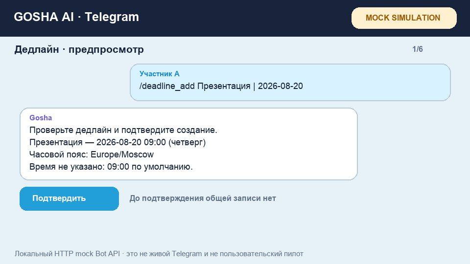

# Gosha Drug — AI-секретарь в учебном Telegram-чате

**Gosha Drug — AI-секретарь, который становится участником чата и помогает в учёбе и командных проектах: запоминает дедлайны, напоминает о сроках и возвращает нужный материал, когда он снова понадобится, по обычному человеческому сообщению.**

Он работает внутри текущего чата: не заставляет открывать отдельный сервис, заполнять форму или вспоминать специальную команду. Пользователь пишет `@goshadrugbot` и формулирует запрос свободно — так же, как написал бы другому участнику чата.



> GIF показывает воспроизводимый mock-сценарий: сохранение дедлайна и материала, подтверждение действия и получение информации другим участником. Это техническая демонстрация, а не запись пользовательского пилота.

## Содержание

- [Проблема](#проблема)
- [Решение](#решение)
- [Что умеет Gosha](#что-умеет-gosha)
- [Как устроена система](#как-устроена-система)
- [Архитектура](#архитектура)
- [Стек технологий](#стек-технологий)
- [Структура проекта](#структура-проекта)
- [Быстрый старт](#быстрый-старт)
- [Переменные окружения](#переменные-окружения)
- [Тесты и проверка качества](#тесты-и-проверка-качества)
- [Ограничения](#ограничения)
- [Что дальше](#что-дальше)

## Проблема

### Важная информация всегда теряется среди множества сообщений в чате

Учёба и командные проекты живут в чатах: там участники договариваются, распределяют обязанности, фиксируют дедлайны и делятся материалами. Но важное в переписке теряется, его приходится заново искать, уточнять у других или сохранять в отдельном месте.

**Гипотеза:** участники учебных чатов регулярно теряют важную информацию в переписке, из-за чего вынуждены искать её заново и переспрашивать друг друга.

Сейчас эту проблему закрывают несколькими способами:

- спрашивают в чате, кто помнит или знает;
- пересылают и повторно публикуют сообщение;
- используют закрепы, теги в избранном и хэштеги;
- отдельно ведут общий календарь или Google-таблицу.

В активном диалоге участники не хотят надолго прерывать текущий сценарий, а главное — выходить из переписки. Они хотят быстро и без труда записать дедлайн или зафиксировать учебный материал.

## Решение

Gosha Drug работает как участник чата. Чтобы обратиться к нему, достаточно написать обычное сообщение:

```text
@goshadrugbot запомни, защита проекта 27 июля в 18:00
@goshadrugbot сохрани материал по исследованию https://example.com/article
@goshadrugbot когда защита проекта?
@goshadrugbot найди материал по исследованию
@goshadrugbot собери всех сюда
```

LLM понимает намерение и извлекает нужные данные из свободной формулировки. Перед важным действием Gosha показывает, что именно он понял, и просит подтвердить или отменить действие.

Решение построено на базе паттерна **«Инлайн-ассистент»** из библиотеки паттернов ВКР — работа в текущем сценарии, не прерываясь. Пользователи уже привыкли передавать AI поиск и первичную обработку информации на простом человеческом языке.

## Что умеет Gosha

### Помнит и напоминает о дедлайнах

Gosha извлекает из сообщения название, дату и время, показывает превью и после подтверждения сохраняет дедлайн для всего чата. Дальше он может вернуть актуальный срок, напомнить за 24 часа и собрать общий дайджест дедлайнов на следующую неделю.

### Запоминает и возвращает материал

Пользователь отправляет ссылку и обычным языком объясняет, что это за материал. Gosha сохраняет ссылку с описанием внутри текущего чата, а позже находит её по человеческому запросу.

Сейчас сохраняются ссылка и её описание. Содержимое страницы не загружается, RAG не используется.

### Исправляет сохранённую информацию

Если срок изменился, администратор может обычным сообщением назвать нужный дедлайн и новую дату. Gosha ищет объект только внутри текущего чата, показывает изменение и применяет его после подтверждения.

### Зовёт участников чата

По свободному запросу вроде `@goshadrugbot собери всех сюда` Gosha готовит групповой вызов, показывает число известных участников и отправляет упоминания только после подтверждения.

Telegram не передаёт боту полный список группы, поэтому Gosha может позвать только известных ему участников: подключившихся через onboarding или тех, чьё присутствие бот увидел после запуска реестра.

### Собирает регулярный CSAT

Раз в месяц Gosha отправляет короткий опрос с шестью emoji-вариантами. Владелец продукта получает среднюю оценку, медиану и количество ответов без вывода индивидуальных оценок в чат.

## Как устроена система

```text
Сообщение с @goshadrugbot
        ↓
LLM или rules baseline определяет намерение и извлекает данные
        ↓
Backend проверяет дату, время, URL, права и границы текущего чата
        ↓
Gosha показывает превью
        ↓
Пользователь подтверждает действие
        ↓
Данные сохраняются в PostgreSQL, напоминания попадают в delivery worker
```

LLM отвечает только за понимание сообщения. Она не получает доступ к SQL, не отправляет сообщения самостоятельно и не изменяет состояние чата. Все права, проверки, запись, повторные запросы и отправка напоминаний контролируются backend. Если AI недоступен или вернул невалидный результат, система не выполняет действие и сохраняет доступ к базовым сценариям через детерминированный fallback.

## Архитектура

```text
Telegram Bot API
      │
      ▼
Telegram adapter ── identity, chat, callbacks, long polling
      │
      ▼
Gosha Service ───── preview, confirm, permissions, business rules
      │                     │
      │                     └── OpenAI-compatible LLM / offline rules
      ▼
PostgreSQL 16 ───── deadlines, materials, pending actions,
      │              participants, audit, CSAT, delivery outbox
      ▼
Delivery worker ─── T-24 reminders, weekly digest, group call, CSAT
```

Основные технические решения:

- состояние каждого учебного чата изолировано по `chat_id`;
- любое значимое изменение проходит `preview → confirm`;
- подтверждение связано с конкретным пользователем и pending-действием;
- delivery outbox различает повторяемую ошибку, постоянный отказ и неопределённый результат отправки;
- текст обычной переписки не сохраняется и не отправляется в AI;
- Docker-контейнеры запускаются без root, с read-only filesystem и `no-new-privileges`.

Подробная схема: [docs/architecture.md](docs/architecture.md) и [TECHNICAL_OVERVIEW.md](TECHNICAL_OVERVIEW.md).

## Стек технологий

| Компонент | Технология | Назначение |
|---|---|---|
| Основной язык | Python 3.11+ | Бизнес-логика, Telegram adapter и worker |
| Пользовательский интерфейс | Telegram Bot API | Работа внутри учебного чата |
| AI-слой | OpenAI-compatible structured output | Понимание свободного запроса и извлечение полей |
| Fallback | `offline-rules-v1` | Детерминированный baseline и базовые сценарии |
| Основная БД | PostgreSQL 16 | Общее состояние чатов, audit, CSAT и outbox |
| Локальное хранение | SQLite | Разработка и debug-профиль |
| Контейнеризация | Docker + Docker Compose | Сборка и запуск сервисов |
| Тестирование | Pytest + Coverage + Ruff | Unit/integration tests и quality gate |
| CI | GitHub Actions | Тесты, PostgreSQL, wheel и Docker smoke |

## Структура проекта

```text
Gosha-Drug/
├── src/gosha/                 # приложение, Telegram adapter, AI providers и storage
│   └── static/                # локальная debug-поверхность
├── tests/                     # unit и integration tests
├── migrations/postgres/       # PostgreSQL migrations 001–005
├── data/                      # синтетические evaluation-наборы
├── evaluation/                # воспроизводимые отчёты rules baseline
├── docs/                      # архитектура, продукт, исследования и экономика
├── assets/demo.gif            # демонстрация сценария
├── scripts/                   # проверки качества и сборка артефактов
├── .github/workflows/ci.yml   # GitHub Actions
├── Dockerfile
├── compose.yaml
├── Makefile
├── TECHNICAL_OVERVIEW.md
└── pyproject.toml
```

## Быстрый старт

### Требования

- Docker 24+;
- Docker Compose 2+;
- Telegram bot token;
- API key и явный model ID для работы со свободным языком.

### Запуск Telegram-бота

```bash
git clone https://github.com/adavty/Gosha-Drug.git
cd Gosha-Drug

cp .env.example .env
# Заполните TELEGRAM_BOT_TOKEN, OPENAI_API_KEY,
# GOSHA_OPENAI_MODEL и GOSHA_TELEMETRY_HMAC_KEY.

make live
make logs
```

Для работы со свободными сообщениями в `.env` должен быть выбран `GOSHA_PROVIDER=openai`. После запуска администратор настраивает часовой пояс чата, например `/setup Europe/Moscow`. Для получения обычных сообщений с упоминанием бота Group Privacy необходимо отключить через BotFather.

Остановка без удаления данных:

```bash
make down
```

### Проверка Docker и PostgreSQL без Telegram-токена

```bash
docker compose up --build config-check
```

Команда поднимает PostgreSQL, применяет пять миграций и проверяет конфигурацию приложения.

### Локальная debug-поверхность

```bash
docker compose --profile debug up --build debug-web
curl http://127.0.0.1:8080/health
```

Debug-интерфейс нужен для локальной проверки state machine и не является production-интерфейсом Telegram.

## Переменные окружения

| Переменная | Назначение |
|---|---|
| `TELEGRAM_BOT_TOKEN` | Токен Telegram-бота |
| `DATABASE_URL` | Подключение к PostgreSQL |
| `GOSHA_PROVIDER` | `openai` для свободного языка или `offline` для baseline |
| `OPENAI_API_KEY` | API key AI-provider |
| `GOSHA_OPENAI_MODEL` | Явный model ID |
| `GOSHA_TELEMETRY_HMAC_KEY` | Псевдонимизация telemetry identifiers |
| `GOSHA_TELEGRAM_OFFSET_FILE` | Durable cursor long polling |
| `GOSHA_OWNER_USER_ID` | Telegram ID владельца с доступом к общей CSAT-статистике |

Реальные ключи не коммитятся. Пример конфигурации находится в [.env.example](.env.example).

## Тесты и проверка качества

```bash
python3 -m venv .venv
. .venv/bin/activate
python -m pip install -e '.[dev,postgres]'
make check
```

Текущий локально подтверждённый результат release candidate `1.2.0`:

| Проверка | Результат |
|---|---|
| Default test profile | `143 passed, 1 PostgreSQL test skipped` |
| PostgreSQL 16 profile | `144 passed` |
| Branch coverage gate | `85%` |
| Ruff | passed |
| Wheel clean install | passed |
| PostgreSQL migrations | `001–005` passed |
| Docker build и `/health` | passed, version `1.2.0` |

Репозиторий также содержит три синтетических набора для rules baseline. Они проверяют воспроизводимость и границы fallback, но не доказывают качество LLM или пользовательскую ценность. Подробности: [docs/evaluation-report.md](docs/evaluation-report.md).

## Ограничения

- Систематическое live-сравнение LLM со сценариями без AI ещё не проведено.
- Текущие evaluation-наборы синтетические и не являются пользовательскими данными.
- Материалы хранятся как ссылка и описание; содержимое страницы не индексируется.
- Групповой вызов работает только для известных боту участников.
- Production load, длительная эксплуатация, retention и willingness to pay пока не доказаны.
- Техническая готовность не равна подтверждённой пользовательской ценности.

## Что дальше

**Продолжать дискавери → развивать экосистему учебного секретаря.**

1. Продолжение дискавери для сбора пользовательской ценности и проектирование фактуры AI-продукта на основе пользовательских данных.
2. Поиск точки монетизации в B2C и B2B и экономически оправданное использование AI-стека.
3. Техническое усложнение продукта на каждом этапе подтверждения ценности.

Подробнее о продуктовой части:

- [Product discovery](docs/product-discovery.md)
- [Связь проекта с ВКР](docs/thesis-foundation.md)
- [Стратегия развития](docs/product-development-strategy.md)
- [Рынок, монетизация и экономика](docs/market-and-business-model.md)
- [Evidence register](docs/evidence-register.md)

## JMLC и AI Product

Проект создан для JMLC 2026 в треке «Управление ИИ-продуктами» и поступления на программу AI Product AI Talent Hub ИТМО. Он продолжает ВКР Алена Давтяна об AI UX: модель помогает понять запрос, система проверяет ограничения, а человек подтверждает значимое действие.

Код распространяется по [MIT License](LICENSE).
